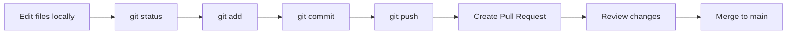

# Git Learner Lab (Mac Local + GitHub)

A practical, lab-based repository to learn Git from zero to advanced level.

Repository target used in labs:
- GitHub URL: `https://github.com/iamkaushiksaha/github`
- Git clone URL: `https://github.com/iamkaushiksaha/github.git`

## Repository Purpose

This repository is meant to stay a **Git learning project**.

It should mainly contain:
- Markdown learning guides
- simple practice files used for Git labs
- examples related to Git workflow, GitHub workflow, and conflict resolution

It should **not** be used as a general web app demo repository unless that is intentionally planned in a separate branch or separate repository.

## Learning Tracks

1. **Basic**
   - Mac setup
   - Create repository + first commit using CLI
   - `status`, `add`, `commit`, `push`, `touch`, folder creation
   - Pull local updates when files are changed/uploaded from GitHub UI

2. **Advanced**
   - Feature branch flow
   - Rebase and clean history
   - Conflict handling labs

3. **Scenarios (Common Issues)**
   - Real mistakes and quick recovery commands

## Git Workflow Diagram



This is the normal learning flow for the labs in this repository.

## Repository Layout

```text
.
├── README.md
└── docs
    ├── basic
    │   ├── 01-setup-mac.md
    │   ├── 02-new-repo-and-initial-steps.md
    │   └── 03-sync-after-github-ui-change.md
    ├── advanced
    │   ├── 01-feature-branch-rebase-lab.md
    │   └── 02-conflict-lab.md
    ├── scenarios
    │   └── common-issues.md
    └── git-learner-guide.doc
```

## Suggested Order

- Start: `docs/basic/01-setup-mac.md`
- Then: `docs/basic/02-new-repo-and-initial-steps.md`
- Then: `docs/basic/03-sync-after-github-ui-change.md`
- Continue with advanced labs
- Use scenarios as daily troubleshooting reference

## Lab Rules

- Run commands yourself (do not just read).
- After each lab, verify with `git status` and `git log --oneline -5`.
- Keep commits small and meaningful.
- Use feature branches for experiments instead of editing `main` directly.
- Review PR file changes before merging, especially if the repo purpose is documentation and training.

## Guardrails for Future Changes

Before merging any PR into `main`, quickly check:
- Does the PR still match the purpose of this repository?
- Are the changed files mostly docs/lab files instead of unrelated app files?
- Is the PR title and description aligned with Git learning content?
- If the PR was generated by tooling, did you review the diff manually?

## If a Wrong PR Gets Merged

If an unrelated PR is merged by mistake:
1. Open the merged PR page.
2. Use the **Revert** button.
3. Create the revert PR.
4. Review the diff carefully.
5. Merge the revert PR into `main`.

For more recovery examples, see `docs/scenarios/common-issues.md`.
