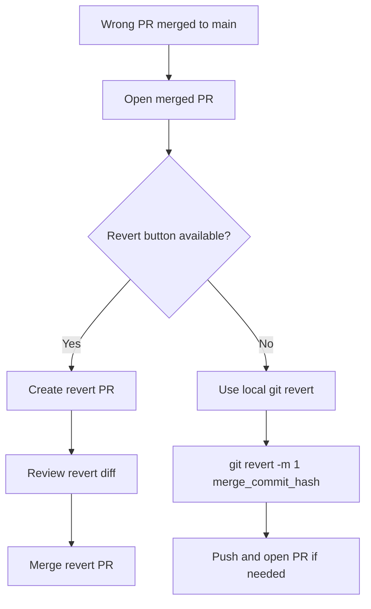

# Common Git Scenarios and Fixes

## 1) Committed on wrong branch

```bash
git log --oneline -5
git checkout correct-branch
git cherry-pick <commit_hash>
```

## 2) Push rejected (non-fast-forward)

```bash
git pull --rebase origin main
git push origin main
```

## 3) Added wrong file

Before commit:

```bash
git restore --staged <file>
```

After commit:

```bash
git rm --cached <file>
git commit -m "Remove accidentally tracked file"
```

## 4) Change last commit message

```bash
git commit --amend -m "Better commit message"
```

## 5) Detached HEAD

```bash
git switch -c rescue-work
```

## 6) Undo uncommitted changes

```bash
git restore <file>
git restore .
```

## 7) Check remote URL

```bash
git remote -v
```

## 8) Visualize branch graph

```bash
git log --oneline --graph --all --decorate
```

## 9) Forgot to pull after GitHub UI edits

```bash
git pull origin main
# or
git pull --rebase origin main
```

## 10) Wrong PR merged into `main`

### Recovery Diagram



### GitHub UI recovery
1. Open the merged pull request.
2. Click **Revert**.
3. Let GitHub create a revert branch and revert PR.
4. Review the changed files.
5. Merge the revert PR into `main`.

### Local Git recovery
```bash
git checkout main
git pull origin main
git revert -m 1 <merge_commit_hash>
git push origin main
```

> Use the merge commit hash of the wrong PR, not just an inner commit from the feature branch.

## 11) Wrong project or unrelated app code added to repo

If the repository is meant for documentation or learning content, check:
- Did the PR add unrelated files like app frontend code?
- Did README purpose change unexpectedly?
- Did docs disappear or get replaced?

If yes, revert the PR instead of trying random manual edits.

## Practice routine

1. Create branch
2. Make small commits
3. Pull with rebase
4. Resolve conflicts
5. Push and open PR
6. Review diff before merging
